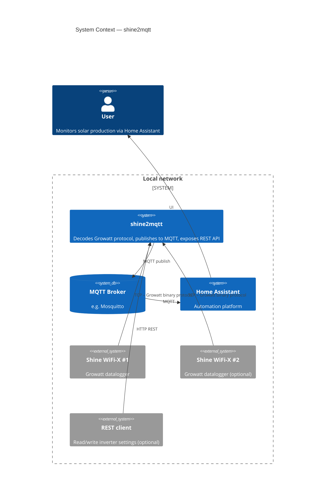
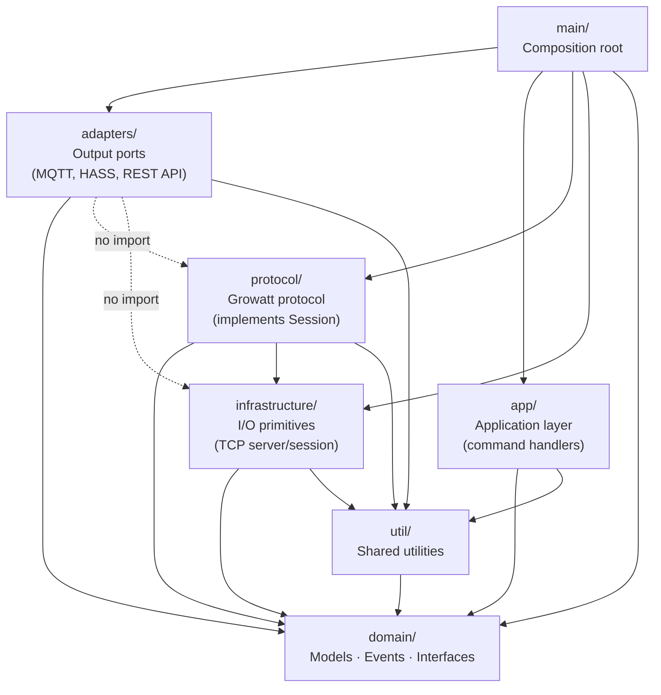
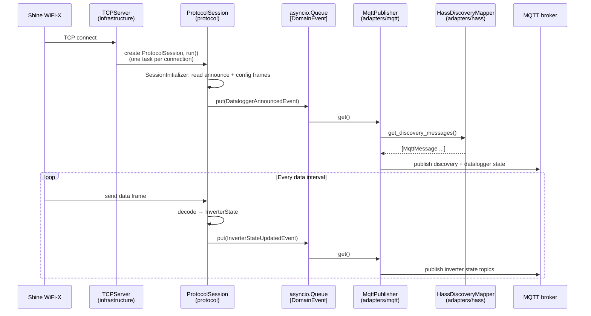
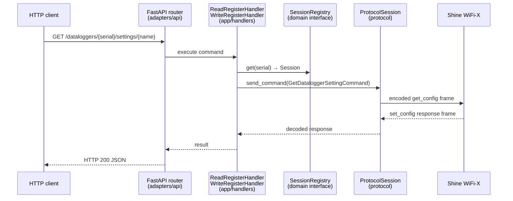

# Architecture

## System Overview

Shine2MQTT acts as a local replacement for Growatt's cloud servers. One or more **Growatt Shine WiFi-X** dataloggers connect to this application over TCP using the proprietary Growatt binary protocol. The application decodes those streams, turns them into domain events, and publishes the data to an **MQTT broker** in a Home Assistant-friendly format. An optional **REST API** allows reading and writing inverter/datalogger settings directly.

---

## Architecture Pattern

The project applies **Hexagonal Architecture** (Ports & Adapters). The core rule is:

> **All dependencies point inward toward `domain/`.** No inner layer may import from an outer layer.

---

## Package Responsibilities

| Package | Responsibility | May import from | Must NOT import from |
|---|---|---|---|
| `domain/` | Core business entities: models, domain events, commands, abstract interfaces. Zero external dependencies. | stdlib only | everything else |
| `protocol/` | Growatt binary protocol: frame encoding/decoding, per-connection state machine, message → domain event mapping. Implements `domain.interfaces.Session`. | `domain/`, `infrastructure/`, `util/` | `adapters/`, `app/`, `main/` |
| `infrastructure/` | Raw asyncio I/O: `TCPServer` accepts connections, `TCPSession` wraps `StreamReader`/`StreamWriter`. No protocol or domain logic. | `domain/`, `util/` | `protocol/`, `adapters/`, `app/`, `main/` |
| `adapters/` | I/O ports to the outside world. Split by direction: **outbound** — `mqtt/publisher` consumes domain events from the queue and publishes MQTT messages; `hass/` builds Home Assistant MQTT discovery payloads. **Inbound** — `mqtt/subscriber` receives MQTT commands (stub); `api/` exposes a FastAPI REST interface for reading and writing inverter/datalogger settings. | `domain/`, `util/` | `infrastructure/`, `protocol/` (except `api/` which currently references `protocol/` session types directly — intended to be cleaned up via application handlers) |
| `app/` | Application-layer command handlers (`ReadRegisterHandler`, `WriteRegisterHandler`). Orchestrates domain commands against the `SessionRegistry` interface. | `domain/`, `util/` | `infrastructure/`, `protocol/`, `adapters/`, `main/` |
| `main/` | **Composition root only.** Wires all concrete implementations, loads `ApplicationConfig`, defines the CLI. Nothing else imports from here. | everything | — |
| `util/` | Shared cross-cutting utilities (logger, clock). No domain knowledge. | stdlib, third-party | `domain/`, `adapters/`, `app/`, `protocol/`, `infrastructure/`, `main/` |

---

## Key Abstractions

### Domain Models (`domain/models/`)

| Model | Purpose |
|---|---|
| `DataLogger` | Represents a connected Shine WiFi-X datalogger (serial, SW version, IP/MAC, protocol ID) |
| `Inverter` | Static inverter identity and settings (serial, FW version, `InverterSettings`) |
| `InverterState` | Live inverter readings: DC/AC power, voltages, currents, energy totals, temperature |

### Domain Events (`domain/events/events.py`)

Events are **immutable dataclasses** placed on `asyncio.Queue[DomainEvent]` by the protocol layer and consumed by adapters.

| Event | Emitted when |
|---|---|
| `DataloggerAnnouncedEvent` | A datalogger connects and completes the announce handshake |
| `InverterStateUpdatedEvent` | A data frame arrives with fresh inverter readings |

### Domain Interfaces (`domain/interfaces/`)

| Interface | Implemented by |
|---|---|
| `Session` | `protocol.session.ProtocolSession` |
| `SessionRegistry` | `protocol.session.ProtocolSessionRegistry` |

### Domain Commands (`domain/commands/commands.py`)

Commands are plain dataclasses that represent intent from the outside world (REST API or MQTT subscriber) toward a connected datalogger/inverter. Current commands include `GetDataloggerSettingByNameCommand`, `UpdateDataloggerSettingByNameCommand`, `ReadInverterRegistersCommand`, and others.

---

## Data Flow

### Event flow — Datalogger → MQTT (currently wired)

The `TCPServer` handles **N concurrent datalogger connections**. Each connection gets its own `ProtocolSession` running as an independent asyncio task, but all sessions share the single `asyncio.Queue[DomainEvent]`.

The `asyncio.Queue[DomainEvent]` is the **only coupling point** between the inbound (protocol) side and the outbound (MQTT/adapters) side. This makes it straightforward to add new consumers without touching the protocol layer.

### Command flow — REST API → Datalogger (intended)

> The REST API adapter and application-layer handlers exist but are not yet wired into `Application`. The intended flow is described below.

The `SessionCommandExecutor` in `main/` bridges the REST API to the protocol session, sending a command frame and awaiting its response via a `Future`.

---

## Composition Root

**`main/app.py` (`Application`) is the only place where concrete implementations are assembled.** It:

1. Creates the `asyncio.Queue[DomainEvent]`
2. Builds `FrameFactory.encoder()` / `FrameFactory.server_decoder()`
3. Constructs `ProtocolSessionFactory` and `ProtocolSessionRegistry`
4. Constructs `TCPServer`
5. Wires the full MQTT stack: `MqttClient` → `MqttPublisher` → `HassDiscoveryMapper` → `MqttBridge`
6. (Intended) Constructs application handlers and passes them to adapters

Configuration is loaded via `ApplicationConfig` (`main/config/config.py`), which uses `pydantic-settings` and supports environment variables (prefix `SHINE2MQTT_`, delimiter `__`) and a YAML config file.

---

## Where to Add New Things

| Goal | Where to change |
|---|---|
| New output destination (e.g. InfluxDB, WebSocket) | Add a new adapter under `adapters/`. Consume from `asyncio.Queue[DomainEvent]`. Wire in `main/app.py`. |
| New domain concept (e.g. battery, grid meter) | Add models to `domain/models/`, new events to `domain/events/events.py`. Extend the protocol mapper to emit the new event. |
| Support a new Growatt protocol message type | Add message dataclass under `protocol/messages/`, add decoder/encoder, handle in `protocol/session/session.py` and `protocol/session/mapper.py`. |
| New inverter/datalogger setting accessible via API | Add a domain command to `domain/commands/commands.py`, implement in the relevant `app/handlers/` handler, expose via `adapters/api/`. |
| New Home Assistant entity | Extend the sensor map in `adapters/hass/map.py` and update `HassDiscoveryPayloadBuilder`. |
| New CLI option or config key | Add to `ApplicationConfig` (or a nested config class) in `main/config/config.py`. |
