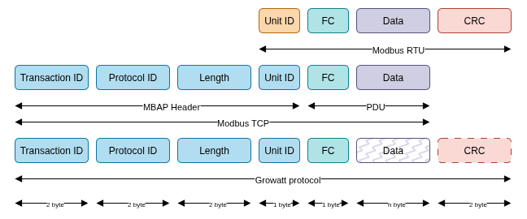

# Growatt TCP Protocol Overview

This document describes the Growatt TCP protocol.

## Protocol Basics

Growatt's protocol is based on Modbus TCP, but with some customizations:

- **Protocol ID**: Modbus always uses 0. Growatt uses 2, 5, or 6 to indicate protocol version.
- **Function Codes**: Some codes match Modbus, others are Growatt-specific.
- **Encryption**: Unlike standard Modbus TCP, Growatt obfuscated the data fro protocol 6.
- **CRC**: Unlike standard Modbus TCP, Growatt appends a Modbus RTU CRC for protocol 5 and 6.

### Protocol Versions

Growatt uses three protocol versions, indicated by the Protocol ID field. The differences between the version are listed in the table below:

| Feature                | Protocol 02 | Protocol 05 | Protocol 06 |
|------------------------|-------------|-------------|-------------|
| Encryption             | No          | Yes         | Yes         |
| Padding                | No          | No          | Yes         |
| CRC-16 Modbus          | No          | Yes         | Yes         |

* Encryption
  * Header (8 bytes) is always unencrypted.
  * Body is encrypted for protocols 05/06 using a repeating "Growatt" XOR mask.
* CRC
  * CRC is appended at the end for protocols 05/06.
* Padding
  * Protocol 06 adds some padding to the announce and data message preamble

### Function Codes

The table below lists the main function codes used in the Growatt protocol:

| Name                           | Code (hex) | Standard Modbus? | type | Description                       |
|--------------------------------|------------|------------------|----------|-------------------------|
| ANNOUNCE                       | 0x03       | No   | periodic  | Send holding registers data       |
| DATA                           | 0x04       | No   | periodic  | Send Input registers data         |
| BUFFERED_DATA                  | 0x50       | No   | periodic  | Same as DATA, but when original messages was not acknowledged  |
| PING                           | 0x16       | No   | periodic  | Ping                              |
| SET_CONFIG                     | 0x18       | No   | datalogger  | Write datalogger configuration    |
| GET_CONFIG                     | 0x19       | No   | datalogger  | Read datalogger configuration     |
| READ_MULTIPLE_HOLDING_REGISTERS| 0x05       | No   | inverter  | Read multiple holding registers   |
| WRITE_SINGLE_HOLDING_REGISTER  | 0x06       | Yes  | inverter  | Write single holding register     |
| WRITE_MULTIPLE_HOLDING_REGISTERS| 0x10      | Yes  | inverter  | Write multiple holding registers  |

## Periodic messages send by datalogger

There are four messages that are pushed periodically by the datalogger to the server:

| Datalogger Message    | Server Response |
|-----------------------|-----------------|
| AnnounceMessage       | AckMessage      |
| DataMessage           | AckMessage      |
| BufferedDataMessage   | AckMessage      |
| PingMessage           | PingMessage     |

> *Announce* messages contain a block of holding registers. *Data* messages contain a block of input registers.

## Requests from server to datalogger

Besides the periodic messages the server can also request from or update data using the datalogger by sending specific messages. The datalogger acts as a bridge between the server and the inverter. So a distinction can be made between messages which read/write data on the datalogger itself or read/write data on the inverter.

### Datalogger message

| Request          | Response            |
|----------------- |---------------------|
| GetConfigRequest | GetConfigResponse   |
| SetConfigRequest | SetConfigResponse   |

### Inverter message

| Request                        | Response                        |
|--------------------------------|---------------------------------|
| ReadMultipleRegistersRequest   | ReadMultipleRegistersResponse   |
| WriteSingleRegisterRequest     | WriteSingleRegisterResponse     |
| WriteMultipleRegistersRequest  | WriteMultipleRegistersResponse  |
